# makerspac.es — Architecture Diagrams

1. [Module Dependency Graph](#1-module-dependency-graph)
2. [Data & Variable Flow](#2-data--variable-flow)
3. [Critical Runtime Flows](#3-critical-runtime-flows)
4. [Data Schemas](#4-data-schemas)
5. [Filter Logic](#5-filter-logic)
6. [URL Routing](#6-url-routing)
7. [Nearby Search](#7-nearby-search)
8. [Service Worker Caching](#8-service-worker-caching)
9. [Bookmark Operations](#9-bookmark-operations)
10. [Three-Frame Zoom](#10-three-frame-zoom-desktop)
11. [Touch / Mobile Guards](#11-touch--mobile-guards)
12. [CSS Architecture](#12-css-architecture)

---

## 1. Module Dependency Graph

Who imports/instantiates whom (static wiring).

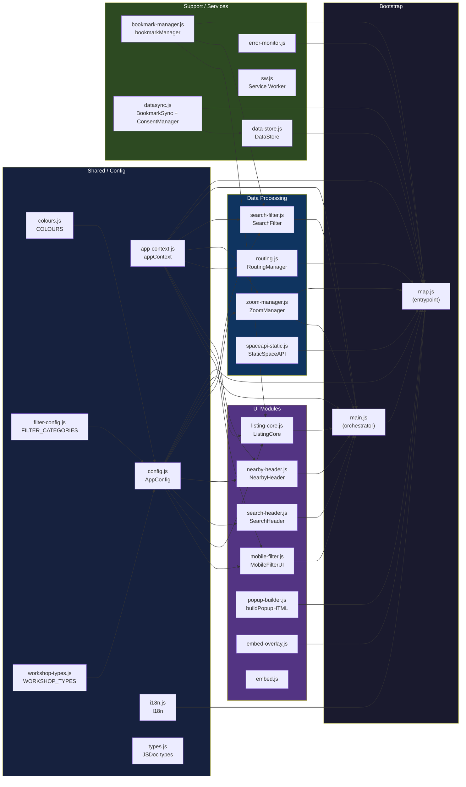
```mermaid
flowchart LR

subgraph ENTRY["Bootstrap"]
    MAP["map.js\n(entrypoint)"]
    MAIN["main.js\n(orchestrator)"]
end

subgraph SHARED["Shared / Config"]
    AC["app-context.js\nappContext"]
    CFG["config.js\nAppConfig"]
    COLS["colours.js\nCOLOURS"]
    FCFG["filter-config.js\nFILTER_CATEGORIES"]
    WT["workshop-types.js\nWORKSHOP_TYPES"]
    I18N["i18n.js\nI18n"]
    TYPES["types.js\nJSDoc types"]
end

subgraph DATA_LAYER["Data Processing"]
    SF["search-filter.js\nSearchFilter"]
    RT["routing.js\nRoutingManager"]
    ZM["zoom-manager.js\nZoomManager"]
    SA["spaceapi-static.js\nStaticSpaceAPI"]
end

subgraph UI_LAYER["UI Modules"]
    SH["search-header.js\nSearchHeader"]
    LC["listing-core.js\nListingCore"]
    MF["mobile-filter.js\nMobileFilterUI"]
    NH["nearby-header.js\nNearbyHeader"]
    PB["popup-builder.js\nbuildPopupHTML"]
    EO["embed-overlay.js"]
    EM["embed.js"]
end

subgraph SUPPORT["Support / Services"]
    DS["data-store.js\nDataStore"]
    BM["bookmark-manager.js\nbookmarkManager"]
    DSYNC["datasync.js\nBookmarkSync + ConsentManager"]
    ERR["error-monitor.js"]
    SW["sw.js\nService Worker"]
end

%% CFG assembles from sub-modules
COLS --> CFG
FCFG --> CFG
WT --> CFG

%% map.js imports everything at boot
AC --> MAP
CFG --> MAP
I18N --> MAP
SA --> MAP
BM --> MAP
DSYNC --> MAP
DS --> MAP
ZM --> MAP
MAIN --> MAP
EO --> MAP
PB --> MAP
ERR --> MAP
RT --> MAP

%% main.js imports
CFG --> MAIN
LC --> MAIN
SF --> MAIN
SH --> MAIN
NH --> MAIN
ZM --> MAIN
MF --> MAIN
AC --> MAIN

%% data processing deps
CFG --> SF
BM --> SF
AC --> SF

CFG --> ZM
AC --> ZM

AC --> RT

CFG --> NH
AC --> NH

%% UI deps
CFG --> SH
CFG --> LC
BM --> LC
AC --> LC

CFG --> MF
AC --> MF

%% support deps
DSYNC --> DS

style ENTRY fill:#1a1a2e,color:#fff
style SHARED fill:#16213e,color:#fff
style DATA_LAYER fill:#0f3460,color:#fff
style UI_LAYER fill:#533483,color:#fff
style SUPPORT fill:#2d4a22,color:#fff
```

---

## 2. Data & Variable Flow

How data travels from sources through processing to rendered output.

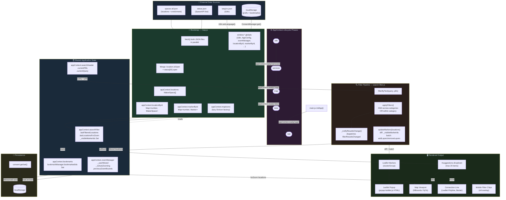
```mermaid
flowchart TB

subgraph SOURCES["📁 External Data Sources"]
    direction LR
    J1["spaces-all.json\n(locations + enrichment)"]
    J2["status.json\n(SpaceAPI live)"]
    J3["lang/xx.json\n(i18n)"]
    LS[("localStorage\n(prefs + bookmarks)")]
end

subgraph BOOT["🚀 Bootstrap — map.js"]
    direction TB
    FETCH["fetch() both JSON files\nin parallel"]
    MERGE["Merge: location.isOpen\n= status[ID].open"]
    LOCS["appContext.locations: MakerSpace[]"]
    LOCMAP["appContext.locationById\nMap&lt;number, MakerSpace&gt;"]
    MKMAP["appContext.markerById\nMap&lt;number, Marker&gt;"]
    ICONS["appContext.mapIcons\n(lazy DivIcon factory)"]
    GLOBALS["window.* globals\n(i18n, AppConfig, zoomManager,\nlocationById, markerById, …)"]
end

subgraph PHASES["⚙️ AppContext Lifecycle Phases"]
    direction LR
    P0(["idle"])
    P1(["services"])
    P2(["map"])
    P3(["data"])
    P4(["app"])
    P0 --> P1 --> P2 --> P3 --> P4
end

subgraph STATE["🗄️ Shared Application State\n(appContext)"]
    direction TB
    STS["appContext.searchFilter\n.lastFilteredLocations\n.lastLocationsForZoom\n._visibleMarkerIds Set"]
    STH["appContext.searchHeader\n.currentPills\n.currentQuery"]
    STZ["appContext.zoomManager\n._userMoved\n._isAutoZooming\n.previousZoomBounds"]
    STB["appContext.bookmarks\nbookmarkManager.bookmarkedIds Set"]
end

subgraph FILTER["🔍 Filter Pipeline — search-filter.js"]
    FT["filterByText(query, pills)"]
    FA["applyFilters()\nAND-across-categories\nOR-within-category"]
    UM["updateMarkers(locations)\ndiff: _visibleMarkerIds\nbatch: addLayers/removeLayers"]
    NRC["_notifyResultsChange()\ndispatches filterResultsChanged"]
end

subgraph RENDER["🖥️ Rendered Output"]
    direction LR
    DROP["#suggestions-dropdown\n(max 20 items)"]
    MKRS["Leaflet Markers\n(clusterGroup)"]
    POPUP["Leaflet Popup\n(popup-builder.js HTML)"]
    ZOOM["Map Viewport\n(fitBounds / flyTo)"]
    LINE["Connection Line\n(Leaflet Polyline, Bezier)"]
    CHIPS["Mobile Filter Chips\n(mf-overlay)"]
end

subgraph PERSIST["💾 Persistence"]
    LS2[("localStorage")]
    COOKIE["consent.get/set()"]
end

%% Sources → Boot
J1 & J2 --> FETCH
FETCH --> MERGE
MERGE --> LOCS
LOCS --> LOCMAP
LOCS --> MKMAP
J3 -->|"i18n.setLanguage()"| GLOBALS
LS -->|"ConsentManager.get()"| GLOBALS

%% Boot → Phases
BOOT -->|"appContext.ready('services')"| P1
BOOT -->|"appContext.ready('map')"| P2
BOOT -->|"appContext.ready('data')"| P3
MAIN_REF["main.js initApp()"] -->|"appContext.ready('app')"| P4

%% State population
LOCMAP --> STS
MKMAP --> STS

%% Filter pipeline wiring
STH -->|"query + pills"| FT
FT --> FA
FA --> UM
FA --> NRC
UM -->|"diff + batch"| MKRS
NRC -->|"callback"| STZ

%% Render
STS -->|"filtered locations"| DROP
STZ -->|"forZoom locations"| ZOOM
MKRS --> POPUP
DROP -->|"hover"| LINE
DROP -->|"click"| ZOOM

%% Persistence
STB -->|"debounced save"| LS2
LS2 -->|"load on boot"| STB
COOKIE --> LS2

%% State reads
STS -.->|"reads"| LOCMAP
STS -.->|"reads"| STB

style SOURCES fill:#1b2838,color:#c7d5e0
style BOOT fill:#1b3a2d,color:#c7d5e0
style PHASES fill:#2d1b33,color:#c7d5e0
style STATE fill:#1a2a3a,color:#c7d5e0
style FILTER fill:#2a1f1a,color:#c7d5e0
style RENDER fill:#1a2a1a,color:#c7d5e0
style PERSIST fill:#2a2a1a,color:#c7d5e0
```

---

## 3. Critical Runtime Flows

### 3a. Event Bus

All custom events and their producers/consumers.

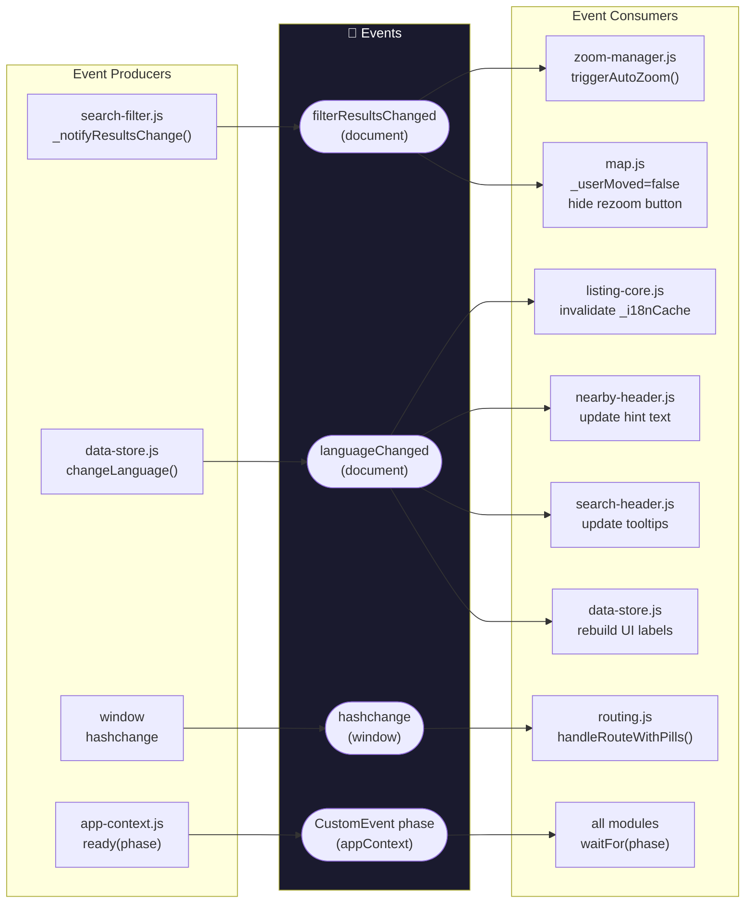
```mermaid
flowchart LR

subgraph PRODUCERS["Event Producers"]
    SF_P["search-filter.js\n_notifyResultsChange()"]
    DS_P["data-store.js\nchangeLanguage()"]
    WIN_P["window\nhashchange"]
    AC_P["app-context.js\nready(phase)"]
end

subgraph EVENTS["📡 Events"]
    E1(["filterResultsChanged\n(document)"])
    E2(["languageChanged\n(document)"])
    E3(["hashchange\n(window)"])
    E4(["CustomEvent phase\n(appContext)"])
end

subgraph CONSUMERS["Event Consumers"]
    ZM_C["zoom-manager.js\ntriggerAutoZoom()"]
    MAP_C["map.js\n_userMoved=false\nhide rezoom button"]
    LC_C["listing-core.js\ninvalidate _i18nCache"]
    NH_C["nearby-header.js\nupdate hint text"]
    SH_C["search-header.js\nupdate tooltips"]
    DS_C["data-store.js\nrebuild UI labels"]
    RT_C["routing.js\nhandleRouteWithPills()"]
    MOD_C["all modules\nwaitFor(phase)"]
end

SF_P --> E1
DS_P --> E2
WIN_P --> E3
AC_P --> E4

E1 --> ZM_C
E1 --> MAP_C
E2 --> LC_C
E2 --> NH_C
E2 --> SH_C
E2 --> DS_C
E3 --> RT_C
E4 --> MOD_C

style EVENTS fill:#1a1a2e,color:#fff
```

---

### 3b. User Interaction: Search → Filter → Zoom

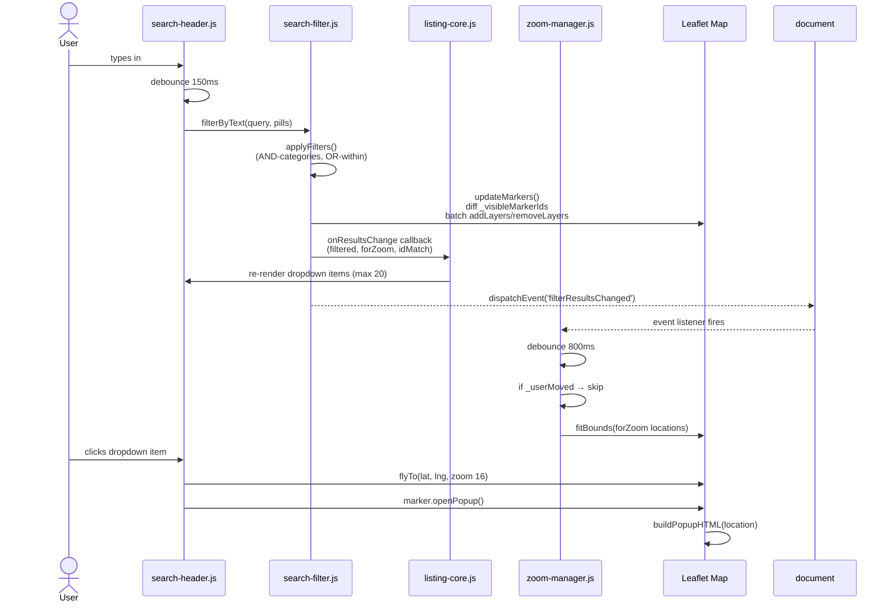
```mermaid
sequenceDiagram
    actor User
    participant SH as search-header.js
    participant SF as search-filter.js
    participant LC as listing-core.js
    participant ZM as zoom-manager.js
    participant MAP as Leaflet Map

    User->>SH: types in #search-bar
    SH->>SH: debounce 150ms
    SH->>SF: filterByText(query, pills)
    SF->>SF: applyFilters()<br/>(AND-categories, OR-within)
    SF->>MAP: updateMarkers()<br/>diff _visibleMarkerIds<br/>batch addLayers/removeLayers
    SF->>LC: onResultsChange callback<br/>(filtered, forZoom, idMatch)
    LC->>SH: re-render dropdown items (max 20)
    SF-->>document: dispatchEvent('filterResultsChanged')
    document-->>ZM: event listener fires
    ZM->>ZM: debounce 800ms
    ZM->>ZM: if _userMoved → skip
    ZM->>MAP: fitBounds(forZoom locations)

    User->>SH: clicks dropdown item
    SH->>MAP: flyTo(lat, lng, zoom 16)
    SH->>MAP: marker.openPopup()
    MAP->>MAP: buildPopupHTML(location)
```

---

### 3c. Desktop Hover: Dropdown Item → SVG + Line + Popup

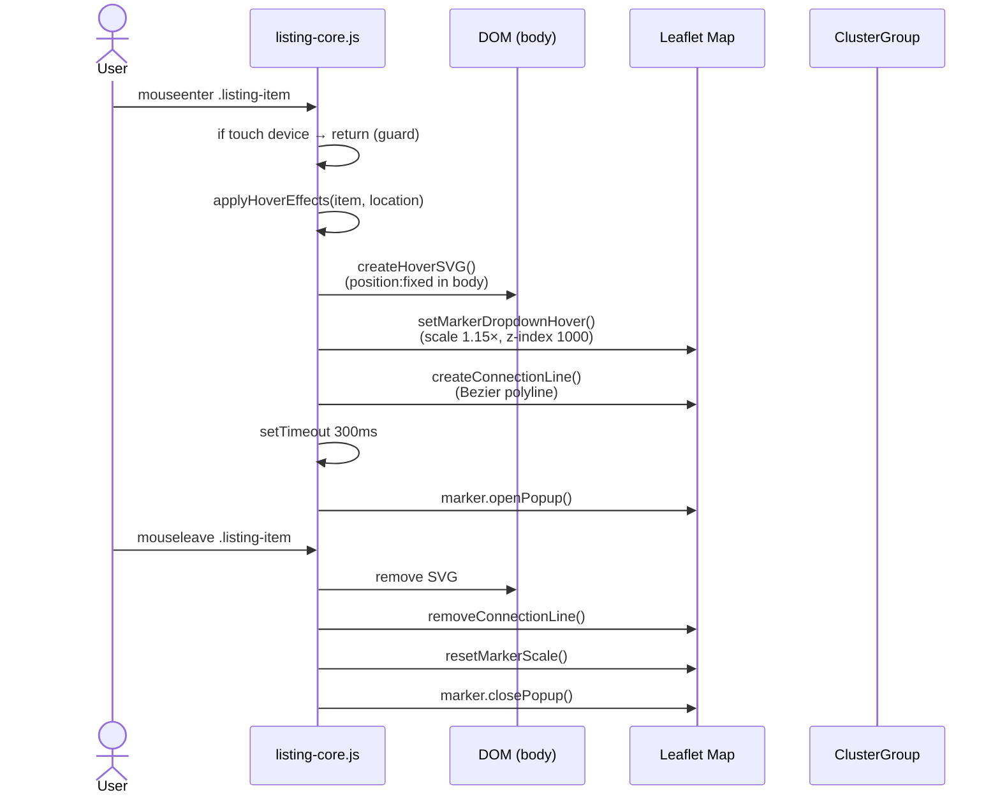
```mermaid
sequenceDiagram
    actor User
    participant LC as listing-core.js
    participant DOM as DOM (body)
    participant MAP as Leaflet Map
    participant CG as ClusterGroup

    User->>LC: mouseenter .listing-item
    LC->>LC: if touch device → return (guard)
    LC->>LC: applyHoverEffects(item, location)
    LC->>DOM: createHoverSVG()<br/>(position:fixed in body)
    LC->>MAP: setMarkerDropdownHover()<br/>(scale 1.15×, z-index 1000)
    LC->>MAP: createConnectionLine()<br/>(Bezier polyline)
    LC->>LC: setTimeout 300ms
    LC->>MAP: marker.openPopup()

    User->>LC: mouseleave .listing-item
    LC->>DOM: remove SVG
    LC->>MAP: removeConnectionLine()
    LC->>MAP: resetMarkerScale()
    LC->>MAP: marker.closePopup()
```

---

### 3d. Marker Click — Sticky Popup State Machine

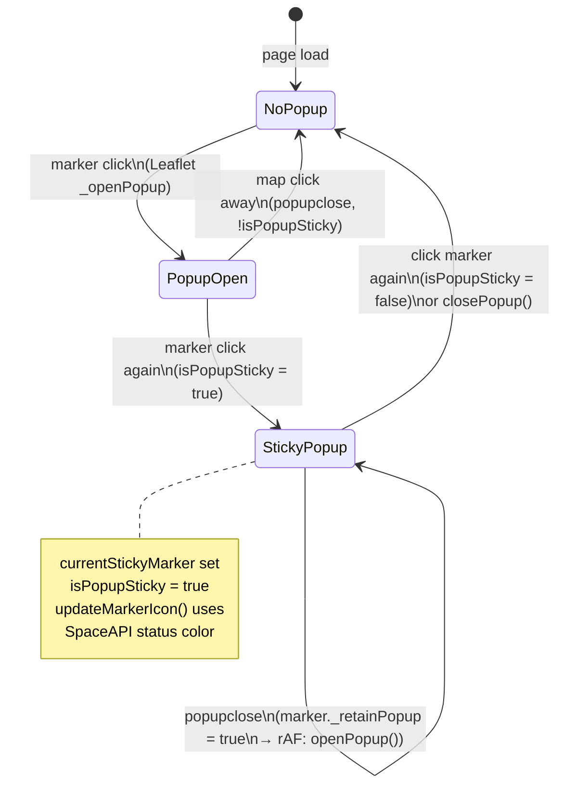
```mermaid
stateDiagram-v2
    [*] --> NoPopup : page load

    NoPopup --> PopupOpen : marker click\n(Leaflet _openPopup)
    PopupOpen --> NoPopup : map click away\n(popupclose, !isPopupSticky)
    PopupOpen --> StickyPopup : marker click again\n(isPopupSticky = true)
    StickyPopup --> StickyPopup : popupclose\n(marker._retainPopup = true\n→ rAF: openPopup())
    StickyPopup --> NoPopup : click marker again\n(isPopupSticky = false)\nor closePopup()

    note right of StickyPopup
        currentStickyMarker set
        isPopupSticky = true
        updateMarkerIcon() uses
        SpaceAPI status color
    end note
```

---

### 3e. AppContext Boot Sequence

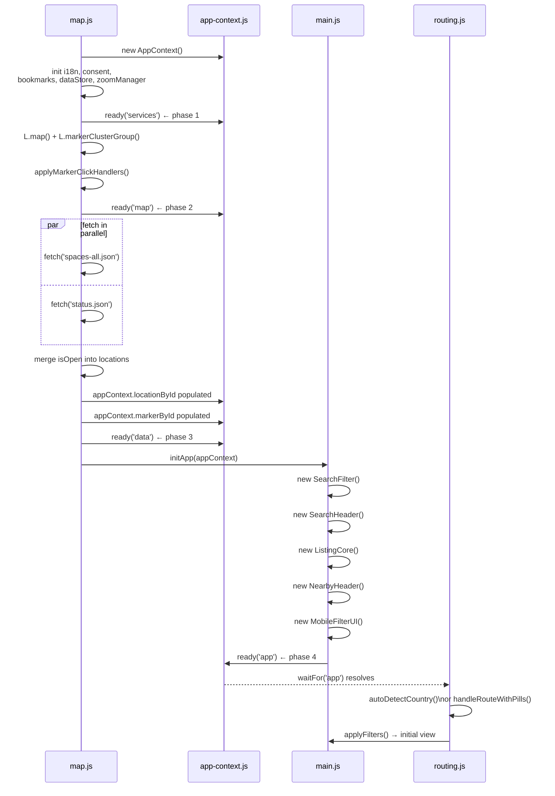
```mermaid
sequenceDiagram
    participant map as map.js
    participant AC as app-context.js
    participant main as main.js
    participant RT as routing.js

    map->>AC: new AppContext()
    map->>map: init i18n, consent,<br/>bookmarks, dataStore, zoomManager
    map->>AC: ready('services') ← phase 1

    map->>map: L.map() + L.markerClusterGroup()
    map->>map: applyMarkerClickHandlers()
    map->>AC: ready('map') ← phase 2

    par fetch in parallel
        map->>map: fetch('spaces-all.json')
    and
        map->>map: fetch('status.json')
    end

    map->>map: merge isOpen into locations
    map->>AC: appContext.locationById populated
    map->>AC: appContext.markerById populated
    map->>AC: ready('data') ← phase 3

    map->>main: initApp(appContext)
    main->>main: new SearchFilter()
    main->>main: new SearchHeader()
    main->>main: new ListingCore()
    main->>main: new NearbyHeader()
    main->>main: new MobileFilterUI()
    main->>AC: ready('app') ← phase 4

    AC-->>RT: waitFor('app') resolves
    RT->>RT: autoDetectCountry()\nor handleRouteWithPills()
    RT->>main: applyFilters() → initial view
```

---

## 4. Data Schemas

All JSON shapes and runtime types used across the system.

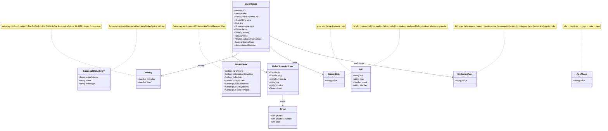
```mermaid
classDiagram

class MakerSpace {
    +number ID
    +string name
    +MakerSpaceAddress loc
    +SpaceStyle style
    +Link link
    +SpaceApi spaceapi
    +Dates dates
    +Weekly weekly
    +string events
    +WorkshopType[] workshops
    +boolean|null isOpen
    +string statusMessage
}

class MakerSpaceAddress {
    +number lat
    +number long
    +string|number plz
    +string city
    +string country
    +Street street
}

class Street {
    +string name
    +string|number number
    +string ext
}

class Weekly {
    +number weekday
    +number time
}
note for Weekly "weekday: 0=Sun 1=Mon 2=Tue 3=Wed 4=Thu 5=Fri 6=Sat 9=no value\ntime: HHMM integer, 0=no value"

class SpaceApiStatusEntry {
    +boolean|null status
    +string name
    +string message
}
note for SpaceApiStatusEntry "From status.json\nMerged at boot into MakerSpace.isOpen"

class MarkerState {
    +boolean isHovering
    +boolean isDropdownHovering
    +boolean isScaling
    +number currentScale
    +number|null hoverTimeout
    +number|null stickyTimeout
    +number|null closeTimeout
}
note for MarkerState "One entry per location ID\nin markerStateManager Map"

class Pill {
    +string text
    +string type
    +number count
    +string filterKey
}
note for Pill "type: city | style | country | zip"

class SpaceStyle {
    +string value
}
note for SpaceStyle "for all | commercial | for students\nfor youth | for students and youth\nfor students slash commercial"

class WorkshopType {
    +string value
}
note for WorkshopType "3d | laser | electronics | wood | metal\ntextile | screenprint | music | coding\nvr | cnc | ceramics | photo | bike"

class AppPhase {
    +string value
}
note for AppPhase "idle → services → map → data → app"

MakerSpace --> MakerSpaceAddress : loc
MakerSpace --> Weekly : weekly
MakerSpace --> SpaceStyle : style
MakerSpace --> WorkshopType : workshops
MakerSpaceAddress --> Street : street
```

---

## 5. Filter Logic

### 5a. Text Search — filterByText()

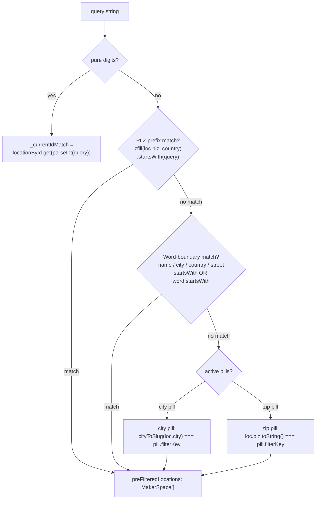
```mermaid
flowchart TB

QUERY["query string"]

D1{"pure digits?"}
IDMATCH["_currentIdMatch =\nlocationById.get(parseInt(query))"]

D2{"PLZ prefix match?\nzfill(loc.plz, country)\n.startsWith(query)"}

D3{"Word-boundary match?\nname / city / country / street\nstartsWith OR word.startsWith"}

PILL{"active pills?"}
PCITY["city pill:\ncityToSlug(loc.city) === pill.filterKey"]
PZIP["zip pill:\nloc.plz.toString() === pill.filterKey"]

OUT["preFilteredLocations: MakerSpace[]"]

QUERY --> D1
D1 -->|yes| IDMATCH
D1 -->|no| D2
D2 -->|match| OUT
D2 -->|no match| D3
D3 -->|match| OUT
D3 -->|no match| PILL
PILL -->|city pill| PCITY
PILL -->|zip pill| PZIP
PCITY & PZIP --> OUT
```

### 5b. Filter Application — applyFilters()

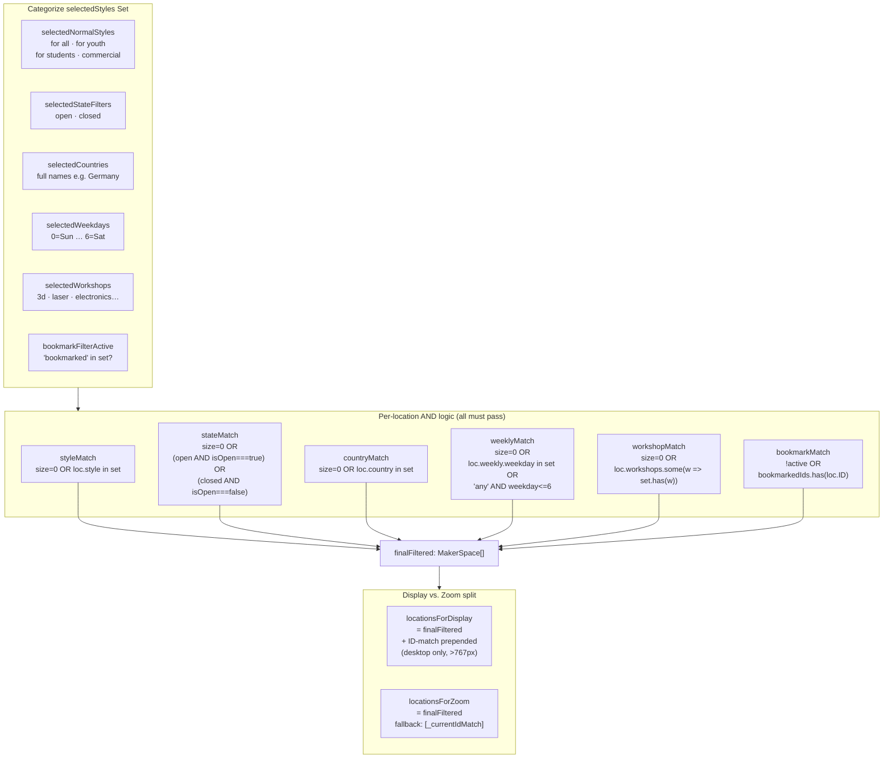
```mermaid
flowchart TB

subgraph CATS["Categorize selectedStyles Set"]
    C1["selectedNormalStyles\nfor all · for youth\nfor students · commercial"]
    C2["selectedStateFilters\nopen · closed"]
    C3["selectedCountries\nfull names e.g. Germany"]
    C4["selectedWeekdays\n0=Sun … 6=Sat"]
    C5["selectedWorkshops\n3d · laser · electronics…"]
    C6["bookmarkFilterActive\n'bookmarked' in set?"]
end

subgraph MATCH["Per-location AND logic (all must pass)"]
    M1["styleMatch\nsize=0 OR loc.style in set"]
    M2["stateMatch\nsize=0 OR\n(open AND isOpen===true) OR\n(closed AND isOpen===false)"]
    M3["countryMatch\nsize=0 OR loc.country in set"]
    M4["weeklyMatch\nsize=0 OR\nloc.weekly.weekday in set OR\n'any' AND weekday<=6"]
    M5["workshopMatch\nsize=0 OR\nloc.workshops.some(w => set.has(w))"]
    M6["bookmarkMatch\n!active OR\nbookmarkedIds.has(loc.ID)"]
end

subgraph SPLIT["Display vs. Zoom split"]
    DISP["locationsForDisplay\n= finalFiltered\n+ ID-match prepended\n  (desktop only, >767px)"]
    ZOOM["locationsForZoom\n= finalFiltered\nfallback: [_currentIdMatch]"]
end

CATS --> MATCH
M1 & M2 & M3 & M4 & M5 & M6 --> RESULT["finalFiltered: MakerSpace[]"]
RESULT --> SPLIT
```

### 5c. Filter Categories Reference

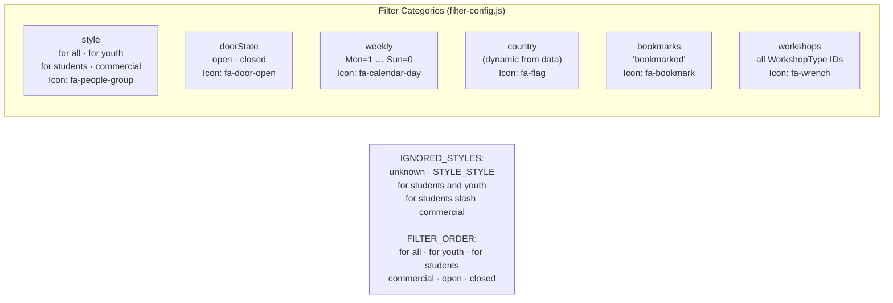
```mermaid
flowchart LR

subgraph FILTER_CATEGORIES["Filter Categories (filter-config.js)"]
    FC1["style\nfor all · for youth\nfor students · commercial\nIcon: fa-people-group"]
    FC2["doorState\nopen · closed\nIcon: fa-door-open"]
    FC3["weekly\nMon=1 … Sun=0\nIcon: fa-calendar-day"]
    FC4["country\n(dynamic from data)\nIcon: fa-flag"]
    FC5["bookmarks\n'bookmarked'\nIcon: fa-bookmark"]
    FC6["workshops\nall WorkshopType IDs\nIcon: fa-wrench"]
end

NOTE["IGNORED_STYLES:\nunknown · STYLE_STYLE\nfor students and youth\nfor students slash commercial\n\nFILTER_ORDER:\nfor all · for youth · for students\ncommercial · open · closed"]
```

---

## 6. URL Routing

### 6a. Hash Pattern Matching (priority order)

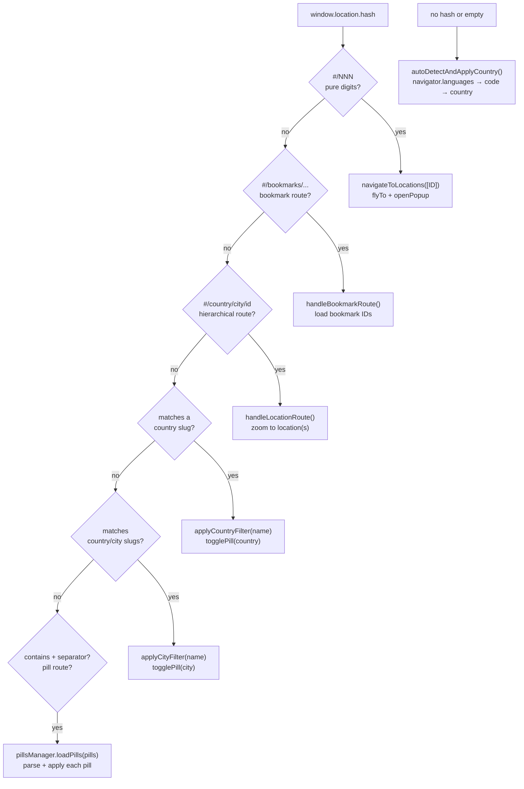
```mermaid
flowchart TD

HASH["window.location.hash"]

P1{"#/NNN\npure digits?"}
P2{"#/bookmarks/...\nbookmark route?"}
P3{"#/country/city/id\nhierarchical route?"}
P4{"matches a\ncountry slug?"}
P5{"matches\ncountry/city slugs?"}
P6{"contains + separator?\npill route?"}
P7["no hash or empty"]

A1["navigateToLocations([ID])\nflyTo + openPopup"]
A2["handleBookmarkRoute()\nload bookmark IDs"]
A3["handleLocationRoute()\nzoom to location(s)"]
A4["applyCountryFilter(name)\ntogglePill(country)"]
A5["applyCityFilter(name)\ntogglePill(city)"]
A6["pillsManager.loadPills(pills)\nparse + apply each pill"]
A7["autoDetectAndApplyCountry()\nnavigator.languages → code → country"]

HASH --> P1
P1 -->|yes| A1
P1 -->|no| P2
P2 -->|yes| A2
P2 -->|no| P3
P3 -->|yes| A3
P3 -->|no| P4
P4 -->|yes| A4
P4 -->|no| P5
P5 -->|yes| A5
P5 -->|no| P6
P6 -->|yes| A6
P7 --> A7
```

### 6b. Slug Normalization — normalizeSlug()

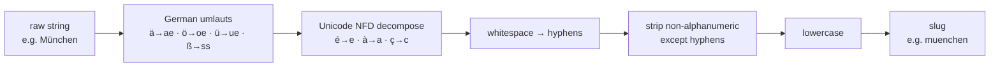
```mermaid
flowchart LR

RAW["raw string\ne.g. München"]
S1["German umlauts\nä→ae · ö→oe · ü→ue · ß→ss"]
S2["Unicode NFD decompose\né→e · à→a · ç→c"]
S3["whitespace → hyphens"]
S4["strip non-alphanumeric\nexcept hyphens"]
S5["lowercase"]
SLUG["slug\ne.g. muenchen"]

RAW --> S1 --> S2 --> S3 --> S4 --> S5 --> SLUG
```

---

## 7. Nearby Search

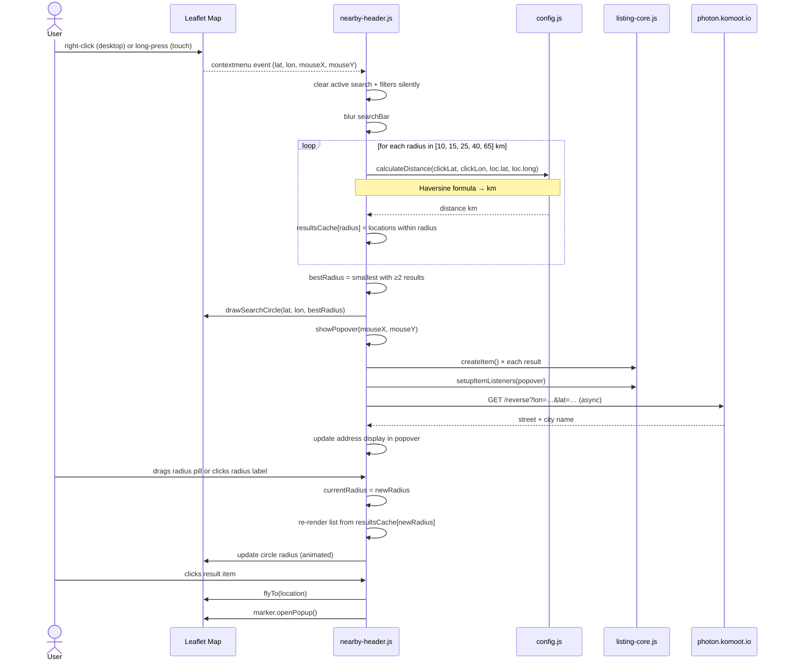
```mermaid
sequenceDiagram
    actor User
    participant MAP as Leaflet Map
    participant NH as nearby-header.js
    participant CFG as config.js
    participant LC as listing-core.js
    participant API as photon.komoot.io

    User->>MAP: right-click (desktop) or long-press (touch)
    MAP-->>NH: contextmenu event (lat, lon, mouseX, mouseY)
    NH->>NH: clear active search + filters silently
    NH->>NH: blur searchBar

    loop for each radius in [10, 15, 25, 40, 65] km
        NH->>CFG: calculateDistance(clickLat, clickLon, loc.lat, loc.long)
        Note over NH,CFG: Haversine formula → km
        CFG-->>NH: distance km
        NH->>NH: resultsCache[radius] = locations within radius
    end

    NH->>NH: bestRadius = smallest with ≥2 results
    NH->>MAP: drawSearchCircle(lat, lon, bestRadius)
    NH->>NH: showPopover(mouseX, mouseY)
    NH->>LC: createItem() × each result
    NH->>LC: setupItemListeners(popover)

    NH->>API: GET /reverse?lon=…&lat=… (async)
    API-->>NH: street + city name
    NH->>NH: update address display in popover

    User->>NH: drags radius pill or clicks radius label
    NH->>NH: currentRadius = newRadius
    NH->>NH: re-render list from resultsCache[newRadius]
    NH->>MAP: update circle radius (animated)

    User->>NH: clicks result item
    NH->>MAP: flyTo(location)
    NH->>MAP: marker.openPopup()
```

---

## 8. Service Worker Caching

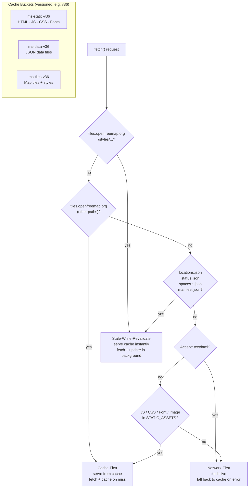
```mermaid
flowchart TD

REQ["fetch() request"]

T1{"tiles.openfreemap.org\n/styles/...?"}
T2{"tiles.openfreemap.org\n(other paths)?"}
T3{"locations.json\nstatus.json\nspaces-*.json\nmanifest.json?"}
T4{"Accept: text/html?"}
T5{"JS / CSS / Font / Image\nin STATIC_ASSETS?"}

CF["Cache-First\nserve from cache\nfetch + cache on miss"]
SWR["Stale-While-Revalidate\nserve cache instantly\nfetch + update in background"]
NF["Network-First\nfetch live\nfall back to cache on error"]

REQ --> T1
T1 -->|yes| SWR
T1 -->|no| T2
T2 -->|yes| CF
T2 -->|no| T3
T3 -->|yes| SWR
T3 -->|no| T4
T4 -->|yes| NF
T4 -->|no| T5
T5 -->|yes| CF
T5 -->|no| NF

subgraph CACHES["Cache Buckets (versioned, e.g. v36)"]
    CA["ms-static-v36\nHTML · JS · CSS · Fonts"]
    CB["ms-data-v36\nJSON data files"]
    CC["ms-tiles-v36\nMap tiles + styles"]
end
```

---

## 9. Bookmark Operations

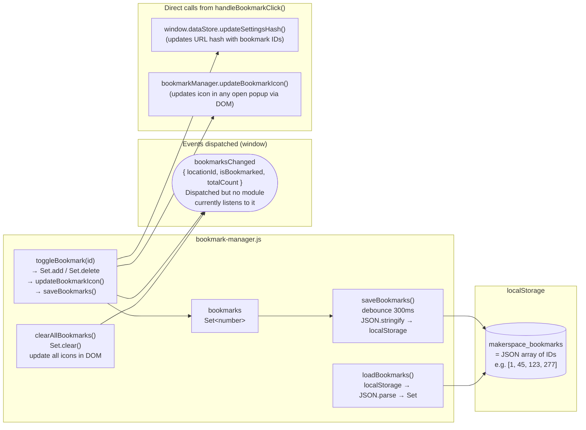
```mermaid
flowchart LR

subgraph BM["bookmark-manager.js"]
    BSET["bookmarks\nSet&lt;number&gt;"]
    TOGGLE["toggleBookmark(id)\n→ Set.add / Set.delete\n→ updateBookmarkIcon()\n→ saveBookmarks()"]
    SAVE["saveBookmarks()\ndebounce 300ms\nJSON.stringify → localStorage"]
    LOAD["loadBookmarks()\nlocalStorage → JSON.parse → Set"]
    CLEAR["clearAllBookmarks()\nSet.clear()\nupdate all icons in DOM"]
end

subgraph PERSIST["localStorage"]
    LS[("makerspace_bookmarks\n= JSON array of IDs\ne.g. [1, 45, 123, 277]")]
end

subgraph EVENTS["Events dispatched (window)"]
    BE(["bookmarksChanged\n{ locationId, isBookmarked, totalCount }\nDispatched but no module\ncurrently listens to it"])
end

subgraph DIRECT["Direct calls from handleBookmarkClick()"]
    DS2["window.dataStore.updateSettingsHash()\n(updates URL hash with bookmark IDs)"]
    IC2["bookmarkManager.updateBookmarkIcon()\n(updates icon in any open popup via DOM)"]
end

TOGGLE --> BSET
BSET --> SAVE
SAVE --> LS
LOAD --> LS
TOGGLE --> BE
TOGGLE --> DS2
TOGGLE --> IC2
CLEAR --> BE
```

---

## 10. Three-Frame Zoom (Desktop)

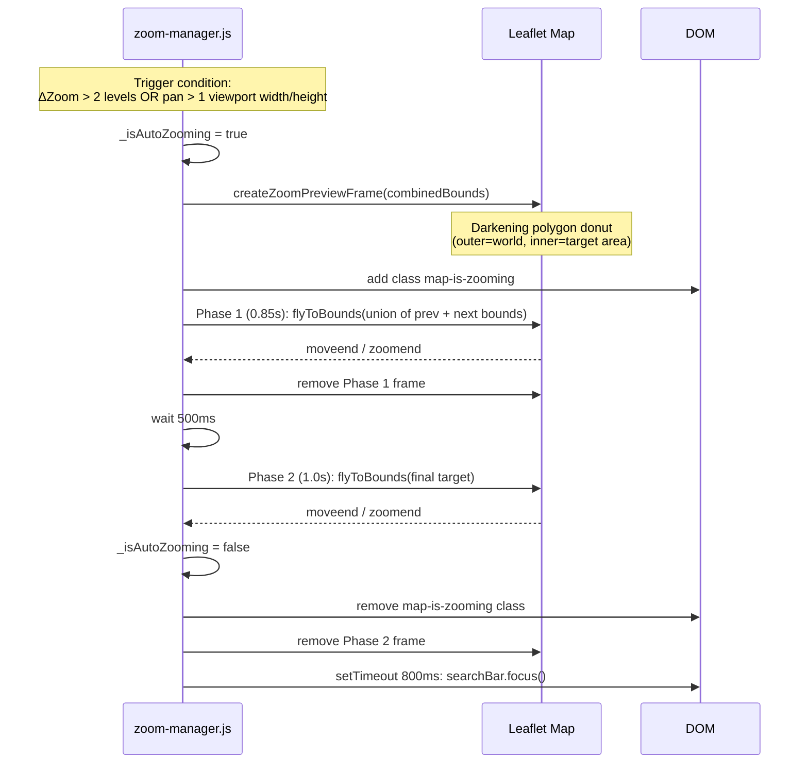
```mermaid
sequenceDiagram
    participant ZM as zoom-manager.js
    participant MAP as Leaflet Map
    participant DOM as DOM

    Note over ZM: Trigger condition:<br/>ΔZoom > 2 levels OR pan > 1 viewport width/height

    ZM->>ZM: _isAutoZooming = true
    ZM->>MAP: createZoomPreviewFrame(combinedBounds)
    Note over MAP: Darkening polygon donut<br/>(outer=world, inner=target area)
    ZM->>DOM: add class map-is-zooming

    ZM->>MAP: Phase 1 (0.85s): flyToBounds(union of prev + next bounds)
    MAP-->>ZM: moveend / zoomend

    ZM->>MAP: remove Phase 1 frame
    ZM->>ZM: wait 500ms

    ZM->>MAP: Phase 2 (1.0s): flyToBounds(final target)
    MAP-->>ZM: moveend / zoomend

    ZM->>ZM: _isAutoZooming = false
    ZM->>DOM: remove map-is-zooming class
    ZM->>MAP: remove Phase 2 frame
    ZM->>DOM: setTimeout 800ms: searchBar.focus()
```

### When Three-Frame vs. Normal Zoom

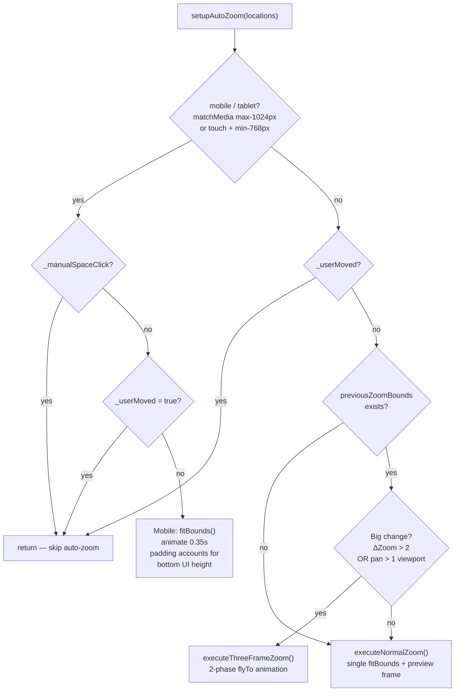
```mermaid
flowchart TD

ZIN["setupAutoZoom(locations)"]
MOB{"mobile / tablet?\nmatchMedia max-1024px\nor touch + min-768px"}
UM{"_userMoved = true?"}
MC{"_manualSpaceClick?"}
PREV{"previousZoomBounds\nexists?"}
BIG{"Big change?\nΔZoom > 2\nOR pan > 1 viewport"}

MZOOM["Mobile: fitBounds()\nanimate 0.35s\npadding accounts for\nbottom UI height"]
SKIP["return — skip auto-zoom"]
TFZ["executeThreeFrameZoom()\n2-phase flyTo animation"]
NZ["executeNormalZoom()\nsingle fitBounds + preview frame"]

ZIN --> MOB
MOB -->|yes| MC
MC -->|yes| SKIP
MC -->|no| UM
UM -->|yes| SKIP
UM -->|no| MZOOM
MOB -->|no| UM2{"_userMoved?"}
UM2 -->|yes| SKIP
UM2 -->|no| PREV
PREV -->|no| NZ
PREV -->|yes| BIG
BIG -->|yes| TFZ
BIG -->|no| NZ
```

---

## 11. Touch / Mobile Guards

Critical rules that prevent bugs on touch devices. **Violating any of these causes known bugs.**

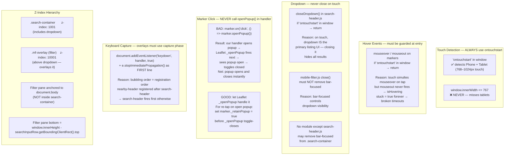
```mermaid
flowchart TD

subgraph TOUCH_DETECT["Touch Detection — ALWAYS use ontouchstart"]
    TD1["'ontouchstart' in window\n✅ detects Phone + Tablet (768–1024px touch)"]
    TD2["window.innerWidth <= 767\n❌ NEVER — misses tablets"]
end

subgraph HOVER_GUARD["Hover Events — must be guarded at entry"]
    HG1["mouseover / mouseout on markers\nif 'ontouchstart' in window → return\n\nReason: touch simultes mouseover on tap\nbut mouseout never fires → isHovering\nstuck = true forever → broken timeouts"]
end

subgraph DROPDOWN_GUARD["Dropdown — never close on touch"]
    DG1["closeDropdown() in search-header.js\nif 'ontouchstart' in window → return\n\nReason: on touch, dropdown IS the\nprimary listing UI — closing it\nhides all results"]
    DG2["mobile-filter.js close()\nmust NOT remove bar-focused\n\nReason: bar-focused controls\ndropdown visibility"]
    DG3["No module except search-header.js\nmay remove bar-focused\nfrom .search-container"]
end

subgraph MARKER_CLICK["Marker Click — NEVER call openPopup() in handler"]
    MC1["BAD: marker.on('click', () => marker.openPopup())\n\nResult: our handler opens popup →\nLeaflet _openPopup fires next →\nsees popup open → toggles closed\nNet: popup opens and closes instantly"]
    MC2["GOOD: let Leaflet _openPopup handle it\nFor re-tap on open popup:\nset marker._retainPopup = true\nbefore _openPopup toggle-closes"]
end

subgraph KEYBOARD["Keyboard Capture — overlays must use capture phase"]
    KB1["document.addEventListener('keydown', handler, true)\n+ e.stopImmediatePropagation() as FIRST line\n\nReason: bubbling order = registration order\nnearby-header registered after search-header\n→ search-header fires first otherwise"]
end

subgraph ZINDEX["Z-Index Hierarchy"]
    ZI1[".search-container       z-index: 1001\n(includes dropdown)"]
    ZI2[".mf-overlay (filter)    z-index: 10001\n(above dropdown — overlays it)"]
    ZI3["Filter pane anchored to document.body\n(NOT inside search-container)"]
    ZI4["Filter pane bottom =\nwindow.innerHeight - searchInputRow.getBoundingClientRect().top"]
end
```

---

## 12. CSS Architecture

```mermaid
flowchart TB

subgraph FILES["CSS Files (loaded via individual link tags — no bundle)"]
    ML["main-layout.css\nBase layout + :root CSS vars\n#map · .title-bar · .search-container\nDark mode via @media prefers-color-scheme"]
    MC["main-components.css\nShared components\nButtons · Badges · Microtip tooltips"]
    MR["main-responsive.css\nResponsive overrides\n@media max-width: 767px"]
    SC["search.css\nSearch bar · Dropdown · Pills · Counter"]
    LC2["listing-core.css\nListing items · Hover animations"]
    NC["nearby.css\nNearby popover · Radius slider · Cursor hint"]
    AC2["autocomplete.css\nAutocomplete suggestion list"]
end

subgraph VARS["CSS Custom Properties — defined in main-layout.css :root"]
    V1["--space-hover      accent / hover green"]
    V2["--space-open       open status green"]
    V3["--space-closed     closed status red"]
    V4["--space-unknown    unknown status orange"]
    V5["--dropdown-bg      dropdown background"]
    V6["--dropdown-border  dropdown border"]
    V7["--dropdown-hover-bg hover state"]
    V8["--text-color       main text"]
    V9["--text-muted       dimmed text"]
    V10["--shadow-color     box shadow"]
    V11["--nearby-title     nearby header bg"]
    V12["--mobile-ui-height set by ResizeObserver\nin mobile-filter.js"]
end

subgraph COLOURS["Dynamic Colours — colours.js + applyCssColours()"]
    COL1["COLOURS object defines\nall status / marker hex values"]
    COL2["applyCssColours() reads isDarkMode()\nsets --space-open --space-closed\n--space-hover --space-unknown\n--nearby-title as CSS vars"]
    COL3["Triggered on: boot + dark mode toggle\nNEVER hardcode hex in JS\nALWAYS use AppConfig.colours.*"]
end

subgraph BP["Breakpoints"]
    BP1["@media (max-width: 767px)\nMobile layout — all mobile CSS here"]
    BP2["@media (max-width: 768px)\nnearby.css popover → sheet"]
    BP3["@media (prefers-color-scheme: dark)\ndark mode overrides in main-layout.css"]
end

ML --> VARS
COLOURS --> COL2
COL2 -->|"sets CSS vars at runtime"| VARS
BP1 -.->|"rule: ALL mobile CSS in this query"| MR
BP1 -.-> SC
BP1 -.-> NC
